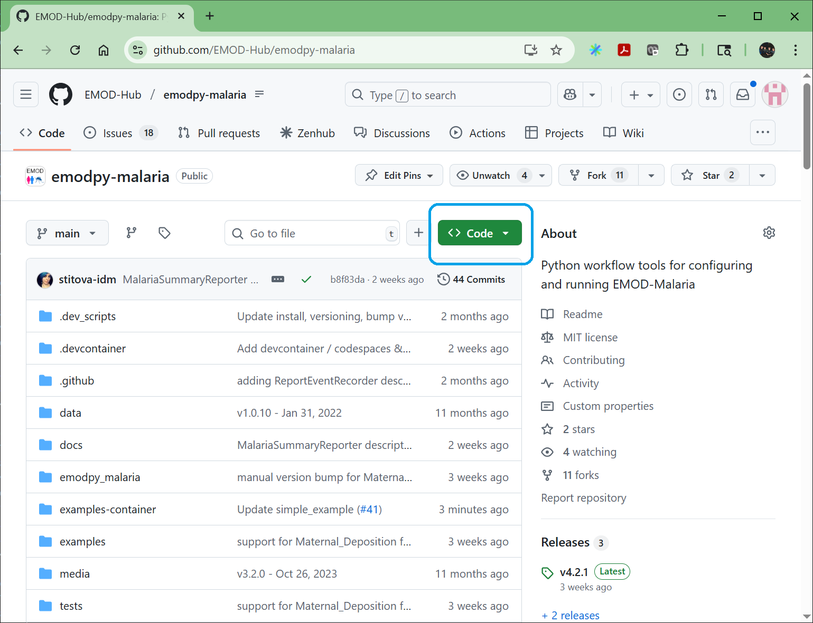
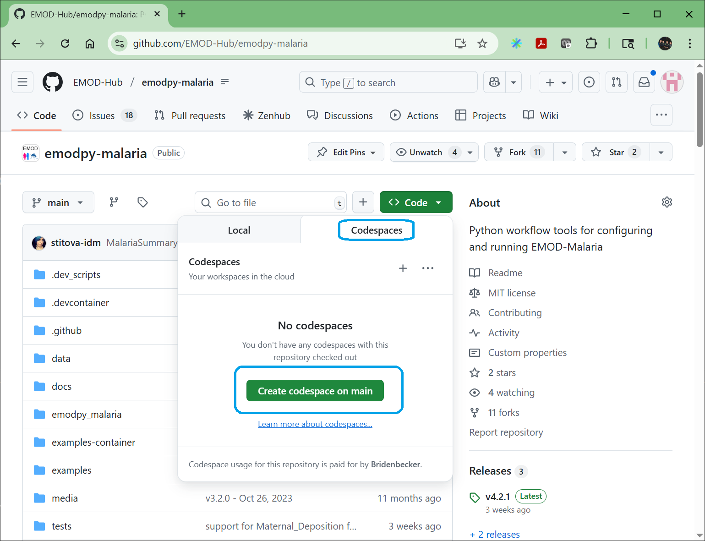
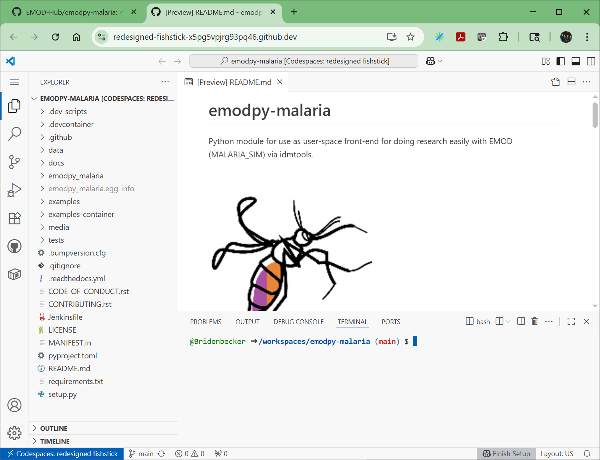
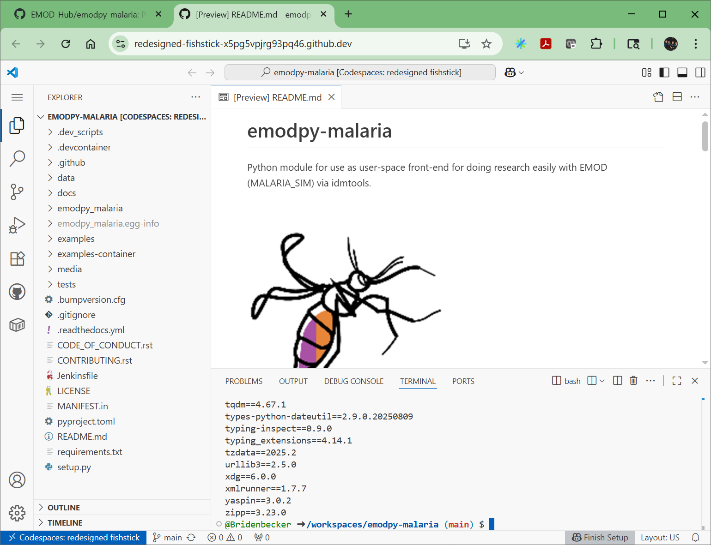

# Starting Codespaces

## Prerequisites

You must have:
- a GitHub account to use Codespaces and
- a web browser like Google Chrome.

## What is GitHub Codespaces

The simple answer is that it is a virtual machine running in the cloud that allows
you to run applications and even develop software.  For the purposes of this tutorial,
you can run EMOD-Malaria and try it out before needing to deal with installation
issues.

See the following link for more information:

https://docs.github.com/en/codespaces/about-codespaces/what-are-codespaces

**WARNING: Codespaces can [cost money](.devcontainer/README.md#-cost-of-using-codespaces-)**

## Start Codespaces

1. Go to the following link in your web browser:

    https://github.com/EMOD-Hub/emodpy-malaria/tree/main

2. Click on the green “<> Code” button

    

3. In the drop down menu, select the green button that says “Create codespace on main”

    

    This will open a new tab with a web version of Visual Studio Code.

    

    You will probably have to wait 10-15 minutes while it builds the environment. 
    When it is done, you should see something like the following:

    

4. To verify that things have been setup correctly, type the following command in the “terminal” window:

    ```
    pip freeze
    ```

    You should see a list like the following:

    

    If you do, then are ready to go. If not, stop and delete the codespace.  Try starting it again.

## Running EMOD

Now that you have Codespaces up and running, you can [run a simple example simulation](tutorial_run_simple_example.md).
